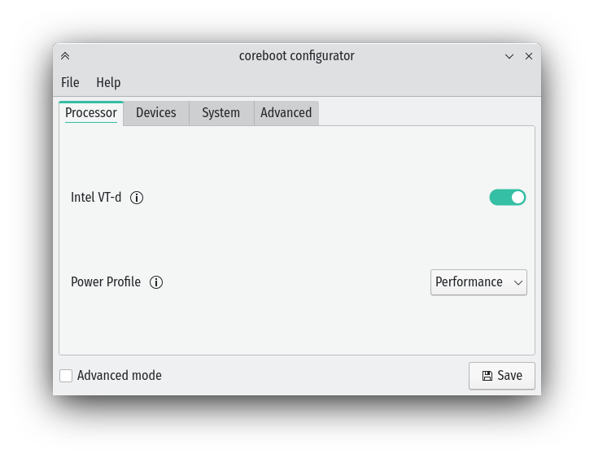

# coreboot-configurator 

A simple GUI to change settings in coreboot's CBFS, via the nvramtool utility.

Requires the same version of coreboot as coreboot-configurator i.e. coreboot 6 with coreboot-configurator 6



# How to install
## Ubuntu, Linux Mint, elementary OS, Zorin OS and other derivates
##### Install
```
sudo add-apt-repository ppa:starlabs/ppa
sudo apt update
sudo apt install coreboot-configurator
```
##### Uninstall
```
sudo apt purge coreboot-configurator
```

## Debian
##### Install
```
echo "deb http://ppa.launchpad.net/starlabs/ppa/ubuntu focal main" | sudo tee -a /etc/apt/sources.list.d/starlabs-ubuntu-ppa-focal.list 
sudo apt-key adv --keyserver keyserver.ubuntu.com --recv-keys 17A20BAF70BEC3904545ACFF8F21C26C794386E3
sudo apt update
sudo apt install coreboot-configurator
```

##### Uninstall
```
sudo apt purge coreboot-configurator
```

## Manjaro
##### Install
```
sudo pacman -Syu coreboot-configurator
```
##### Uninstall
```
sudo pacman -Rns coreboot-configurator
```

## Other Distributions
##### Install
```
git clone https://github.com/StarLabsLtd/coreboot-configurator.git
cd coreboot-configurator
meson build
ninja -C build install
```
##### Uninstall
```
sudo ninja -C uninstall
```

# [© Star Labs® / All Rights Reserved.](https://starlabs.systems)
Any issues or questions, please contact us at [support@starlabs.systems](mailto:supportstarlabs.systems)

View our full range of Linux laptops at: [https://starlabs.systems](https://starlabs.systems)

